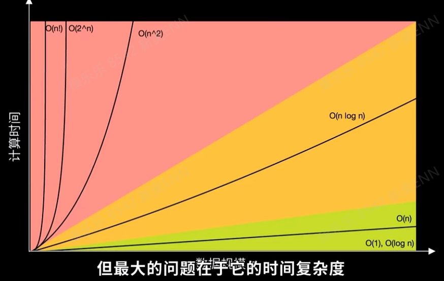
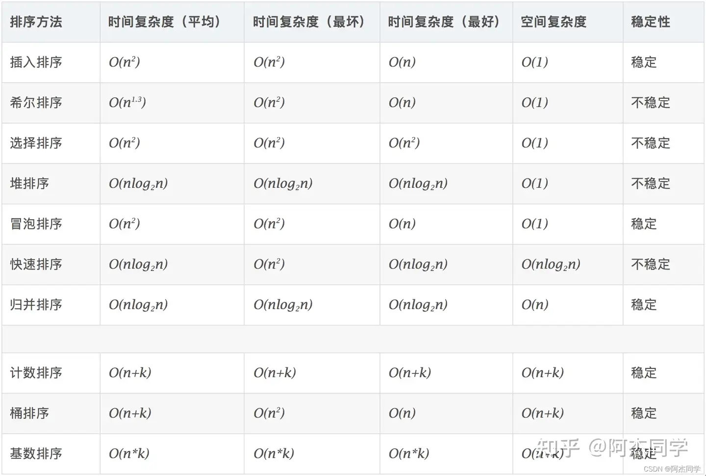

# 基础


## 快排


### java标准写法
```java
/**
 * 快排,时间平均O(nlogn)，空间O(1)
 * ①找基准点：一般是数组的第一个元素来充当；
 *
 * ②right：从数组的最后一个元素开始，从右往左，直到找到小于基准点的元素；每次都要right比left先走；
 *
 * ③left：从数组的第一个元素开始，从左往右，直到找到大于基准点的元素；
 *
 * ④交换 left 和 right 所在位置的两个元素；
 *
 * ⑥right 继续往左走，找到小于基准点的元素；left 继续往右走，找到大于基准点的元素；然后 left 和 right 再做交换；循环往复，直到两人相遇；
 *
 * ⑦将相遇点所在位置的元素和基准点所在位置的元素做交换，基准点到了中间位置（此时基准点左边的元素全都小于基准点右边的元素）；
 *
 * ⑧【递归】将基准点左边的所有元素当成一个数组
 *
 * @author kanglele
 * @version $Id: FastRow, v 0.1 2022/6/9 10:49 kanglele Exp $
 */
public class FastRowSort {

    /**
     * 将数组拆分，递归进行二分查找
     */
    private static void qsort(int[] arr, int low, int high) {
        if (low >= high) {
            return;
        }
        int begin = low;
        int end = high;
        int position = partion(arr, low, high);
        qsort(arr, begin, position-1);
        qsort(arr, position+1, end);
    }

    /**
     *  按照最右侧的元素为基准，返回基准值在low~high范围中的位置 左指针要先移动
     *  如果是最左为基准，需要右指针先移动
     */
    private static int partion(int[] arr, int low, int high) {
        int baseVal = arr[high];
        while (low < high) {
            //从左侧开始查找大于基准值的元素，并移到右侧
            while (low < high && arr[low] <= baseVal) {
                low++;
            }
            arr[high] = arr[low];
            //从右侧开始查找小于基准值的元素，并移到左侧
            while (low < high && arr[high] >= baseVal) {
                high--;
            }
            arr[low] = arr[high];
        }
        //将基准值移到中位
        arr[low] = baseVal;
        //返回中间位置
        return low;
    }
}

```

## 二分查找

### java标准写法
````java
/**
 * 二分查找
 * @author kanglele
 * @version $Id: BinarySearch, v 0.1 2024/10/16 上午10:50 kanglele Exp $
 */
public class BinarySearch {
    public static int binarySearch(int[] nums, int target) {
        int left = 0;
        int right = nums.length - 1;

        while (left <= right) {
            // 防止溢出
            int mid = left + (right - left) / 2;

            // 检查中间元素是否是目标值
            if (nums[mid] == target) {
                return mid; // 找到目标值，返回索引
            }

            // 如果目标值小于中间元素，则在左半部分继续查找
            if (target < nums[mid]) {
                right = mid - 1;
            } else {
                // 如果目标值大于中间元素，则在右半部分继续查找
                left = mid + 1;
            }
        }

        // 如果没有找到目标值，返回 -1
        return -1;
    }
    
}
````

## 二叉树遍历

### java标准写法
```java
/**
 * 前序遍历、中序遍历、后序遍历和层序遍历  广度优先搜索（BFS） 深度优先搜索（DFS）
 * @author kanglele
 * @version $Id: BinaryTreeTraversal, v 0.1 2024/10/16 下午4:15 kanglele Exp $
 */
public class BinaryTreeTraversal {

    /**
     * 前序遍历
     * @param root
     */
    public void preOrderTraversal(TreeNode root) {
        if (root == null) return;
        System.out.print(root.val + " ");
        preOrderTraversal(root.left);
        preOrderTraversal(root.right);
    }

    /**
     * 中序遍历
     * @param root
     */
    public void inOrderTraversal(TreeNode root) {
        if (root == null) return;
        inOrderTraversal(root.left);
        System.out.print(root.val + " ");
        inOrderTraversal(root.right);
    }

    /**
     * 后序遍历
     * @param root
     */
    public void postOrderTraversal(TreeNode root) {
        if (root == null) return;
        postOrderTraversal(root.left);
        postOrderTraversal(root.right);
        System.out.print(root.val + " ");
    }

    /**
     * 层序遍历
     * @param root
     */
    public void levelOrderTraversal(TreeNode root) {
        if (root == null) {return;}
        Queue<TreeNode> queue = new LinkedList<>();
        queue.add(root);
        while (!queue.isEmpty()) {
            TreeNode current = queue.poll();
            System.out.print(current.val + " ");
            if (current.left != null) {
                queue.add(current.left);
            }
            if (current.right != null) {
                queue.add(current.right);
            }
        }
    }
    /**
     * 二叉树的S形层次遍历
     */
    public static void slOrder(TreeNode root) {
        if (root == null) {
            return;
        }
        TreeNode ptr = root;
        Stack<TreeNode> stack1 = new Stack<>();
        Stack<TreeNode> stack2 = new Stack<>();

        stack1.push(ptr);
        while (!stack1.isEmpty()) {
            while (!stack1.isEmpty()) {
                ptr = stack1.pop();
                System.out.print(ptr.val + " ");
                if (ptr.left != null) {
                    stack2.push(ptr.left);
                }
                if (ptr.right != null) {
                    stack2.push(ptr.right);
                }
            }
            while (!stack2.isEmpty()) {
                ptr = stack2.pop();
                System.out.print(ptr.val + " ");
                if (ptr.right != null) {
                    stack1.push(ptr.right);
                }
                if (ptr.left != null) {
                    stack1.push(ptr.left);
                }
            }
        }
    }

    /**
     * 广度优先搜索（BFS）,时间复杂度：O(n),空间复杂度：O(1)-O(w)，其中 w 是树的最大宽度
     * @param root
     */
    public void breadthFirstSearch(TreeNode root) {
        if (root == null) return;
        Queue<TreeNode> queue = new LinkedList<>();
        queue.add(root);
        while (!queue.isEmpty()) {
            TreeNode current = queue.poll();
            System.out.print(current.val + " ");
            if (current.left != null) queue.add(current.left);
            if (current.right != null) queue.add(current.right);
        }
    }

    /**
     * 深度优先搜索（DFS）,时间复杂度：O(n),空间复杂度：O(h)，其中 h 是树的高度
     *
     * @param root
     */
    public void depthFirstSearch(TreeNode root) {
        if (root == null) return;
        System.out.print(root.val + " ");
        depthFirstSearch(root.left);
        depthFirstSearch(root.right);
    }

    /**
     * 时间复杂度：O(n),空间复杂度：O(w)，其中 w 是树的最大宽度
     *
     * @param root
     */
    public void depthFirstSearchIterative(TreeNode root) {
        if (root == null) return;
        Stack<TreeNode> stack = new Stack<>();
        stack.push(root);
        while (!stack.isEmpty()) {
            TreeNode current = stack.pop();
            System.out.print(current.val + " ");
            if (current.right != null) stack.push(current.right);
            if (current.left != null) stack.push(current.left);
        }
    }

    class TreeNode {
        int val;
        TreeNode left;
        TreeNode right;
        TreeNode(int x) { val = x; }
    }
}

```

## 动态规划

### 简单类型
#### 斐波拉切数列和青蛙跳台阶

````java
/**
 * 斐波拉切数列和青蛙跳台阶
 *
 * n>3:f(n)=f(n-1)+f(n-2)  n=1或n=2时 f(n)=1   1 1 2 3 5 8 13 。。。
 * @author kanglele
 * @version $Id: FiboacciSequence, v 0.1 2022/6/9 11:00 kanglele Exp $
 */
public class FiboacciSequence {

    public static int fib_1(int n) {
        if(n < 2) {
            return n;
        }

        return fib_1(n-1) + fib_1(n-2);
    }

    /**
     * 自上而下优化
     * @param n
     * @param cache
     * @return
     */
    public static int fib_2(int n,int[] cache) {
        if(n < 1) {
            return 0;
        }
        if(cache[n] != 0){
            return cache[n];
        }
        if(n <= 2) {
            cache[n] = 1;
        } else {
            cache[n] = fib_2(n-1,cache) + fib_2(n-2,cache);
        }
        return cache[n];
    }

    /**
     * 自下而上优化
     * @param n
     * @return
     */
    public static int fib_3(int n) {
        if(n < 1) {
            return 0;
        }
        int[] memory = new int[n+1];
        for(int i=0;i<=n;i++){
            if(i<=2){
                memory[i]=1;
            }else{
                memory[i]=memory[i-1]+memory[i-2];
            }
        }
        return memory[n];
    }

    /**
     * 变量赋值优化
     * @param n
     * @return
     */
    public static int fib_4(int n) {
        if(n < 1) {
            return 0;
        }
        int memory = 1;
        int memory_1 = 0;
        int memory_2 = 1;
        for(int i=2;i<=n;i++){
            memory=memory_1+memory_2;
            memory_1=memory_2; //前一个数
            memory_2=memory; //现在的数
        }
        return memory;
    }

    /**
     * 最优写法
     * @param n
     * @return
     */
    public static int fib_5(int n) {
        if(n < 2){
            return n;
        }
        int a = 1;
        int b = 1;
        for(int i=2;i<=n;i++){
            b = a+b;
            a = b-a;
        }
        return b;
    }
}
````